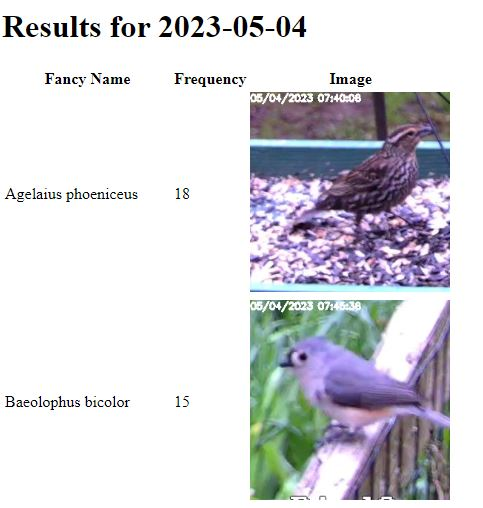

# Who's At My Feeder?

This app works with [Frigate](https://frigate.video/) to identify the species of
the birds that Frigate detects.

I'm using the tflite model from here: https://tfhub.dev/google/lite-model/aiy/vision/classifier/birds_V1/3

Download the model and put it in the directory with speciesid.py. I renamed it
model.tflite, but you can leave it as is if you'd like.

You'll need to run this in a venv with Python 3.8 as the tflite libraries aren't
available for 3.10. You'll need a variety of libraries including...
- tflite-support
- Flask
- PyYAML
- opencv-python
- EcoNameTranslator

... and probably some others that I'm forgetting.

To make it go, set up Frigate to detect the 'bird' object in a video stream, and
to send out snapshots. Then edit the values in config.yml to reflect your installation.

There are two scripts to run...
- speciesid.py listens to snapshot
messages from Frigate, runs the attached images through the
classifier, and stores results to a sqlite database.
- webui.py provides a web ui to show the results

## To Do...
- Containerize the application to make running it easier
- Add some more functions to the Web UI
- Run the web UI with a more robust web server
