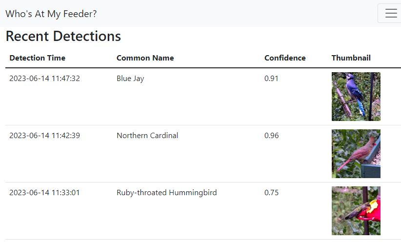

# Who's At My Feeder?

This app acts as sidecar to [Frigate](https://frigate.video/) to identify the species of the birds that Frigate detects. It is using the bird species classifier model found here: https://tfhub.dev/google/lite-model/aiy/vision/classifier/birds_V1/3

## What's New?
I'm just about to push a significant update. This will require you to...
* Delete you current speciesid.db database. If you are attached to that data, just move it somewhere else
* Update your config.yml file to specify the url of your frigate installation, e.g. http://192.168.1.75:5000
  * For those using HAOS add-ons for their Frigate install and possibly running WhosAtMyFeeder on a different box, by default HA doesn't expose port 5000 for Frigate. You have to explicitly configure the Frigate add-on to expose it by going to the Frigate add-on -> Configuration tab and under network add port 5000 against the "Web Interface" config. Without this, it's only exposed internally and not on your wider network and thus won't work.

Why the changes? I have updated the app in a number of ways...
* I'm no longer saving images as Frigate already has them. The images you see in the app now come right from Frigate
* You'll also be able to view the video clip associated with a detection
* There will a maximum of 1 detection stored per Frigate event. This app looks at every snapshot that Frigate provides and
saves the ID with the best score.
* I'm populating the Frigate sub-label for events in which a bird species is IDs with a score above the configured threshold.
Actually I'm populating it with the first 20 characters of the bird species common name because apparently the sub label
field is currently limited to 20 characters
* I also changed (improved, I hope) the UI significantly. I don't think there's any lost functionality.



**Prequisites**

1. A working & Accessible Frigate Installation with at least 1 Camera configured
2. A MQTT Broker that Frigate successfully connects to
3. Configuration of the camera(s) in Frigate to DETECT and SNAPSHOT the 'bird' OBJECT

*Frigate Config*

As a prerequisite of running this project, you must set up Frigate to detect the ['bird' object](https://docs.frigate.video/configuration/objects) in a video stream, and
to send out [snapshots](https://docs.frigate.video/configuration/snapshots). This also assumes you have setup a MQTT broker, like [Mosquitto MQTT](https://github.com/eclipse/mosquitto)

*Example Frigate Config Needed 
(This is purely for reference. This config assumes you have a CORAL TPU USB and Intel IGPU using VAAPI and most likely will not work if you copy and paste. Please tune it to your Frigate & MQTT configuration. See the full Frigate configuration file documentation [here](https://docs.frigate.video/configuration/))*

```
mqtt:
  host: 192.168.1.100
  port: 1883
  topic_prefix: frigate
  user: mqtt_username_here
  password: mqtt_password_here
  stats_interval: 60
detectors:
  coral:
    type: edgetpu
    device: usb
ffmpeg:
  global_args: -hide_banner -loglevel warning
  hwaccel_args: preset-vaapi
  input_args: preset-rtsp-generic
  output_args:
    # Optional: output args for detect streams (default: shown below)
    detect: -threads 2 -f rawvideo -pix_fmt yuv420p
    # Optional: output args for record streams (default: shown below)
    record: preset-record-generic
detect:
  width: 1920
  height: 1080
objects:
  track:
    - bird
snapshots:
  enabled: true
cameras:
  birdcam:
    record:
        enabled: True
        events:
          pre_capture: 5
          post_capture: 5
          objects:
            - bird
    ffmpeg:
      hwaccel_args: preset-vaapi
      inputs:
        - path: rtsp://192.168.1.101:8554/cam
          roles:
            - detect
            - record
    mqtt:
      enabled: True
      bounding_box: False #this will get rid of the box around the bird. We already know it is a bird. Sheesh.
      timestamp: False #this will get rid of the time stamp in the image. 
      quality: 95 #default quality is 70, which will get you lots of compression artifacts
      
```

*Docker Config*

Then, on the machine where you want to run this app, create a new directory. Copy
the docker-compose.yml file from here into that directory. Take a quick peek
at that file and make any changes that might be needed, like the timezone.

In your directory, make a directory called config, and copy config/config.yml from this repo
into your config directory. Edit the file to make changes for your setup. You can add the names
of multiple cameras to the camera array. The model is already
in the image, so unless you want to use a different model, no need to change the
model name.

Finally, make a directory called data. The database will be created there.

Your directory structure should now look something like this before starting the container:
* /whosatmyfeeder
    * docker-compose.yml
    * /data/
    * /config/
        * config.yml

**Running the container**

Once you have completed the above, fire it up with `docker-compose up -d` 
If you used the default config file and default docker-compose file you should be able to access the web UI at: 
http://127.0.0.1:7766 or on http://yourserveraddress:7766

**Docker Image**
The image is on Docker Hub at https://hub.docker.com/r/mmcc73/whosatmyfeeder
